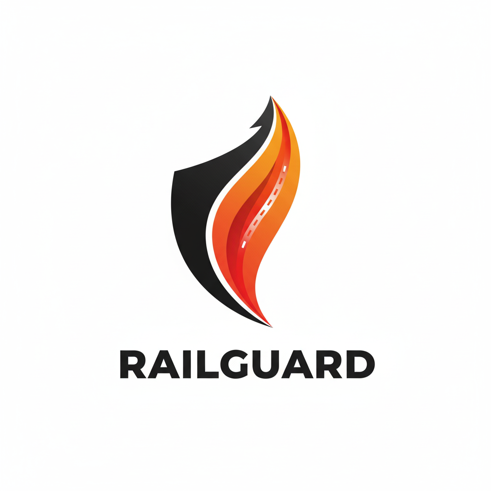

# 🚄 RailGuard — Система защиты топливной системы

Веб-приложение для продажи и управления заказами системы защиты топливной системы RailGuard.



---

## 📦 Структура проекта

```
├── components/     # Универсальные React-компоненты интерфейса
├── contexts/       # React-контексты для глобального состояния
├── hooks/          # Пользовательские React-хуки
├── lib/            # Вспомогательные библиотеки и интеграции (например, Prisma)
├── pages/          # Страницы Next.js (включая API-роуты)
├── posts/          # Статьи и контент в формате MDX
├── prisma/         # Схема и миграции базы данных
├── public/         # Статические файлы (изображения, иконки, стили)
├── utils/          # Утилиты и вспомогательные функции
├── views/          # Крупные компоненты-виды для страниц
├── env.ts          # Работа с переменными окружения
├── types.ts        # Глобальные типы TypeScript
└── ...             # Конфигурационные и служебные файлы
```

---

## 🚀 Быстрый старт

### 1. Клонирование репозитория

```bash
git clone https://github.com/BigVadya/Fuel.git
cd Fuel
```

### 2. Установка зависимостей

```bash
yarn install
# или
npm install
```

### 3. Настройка переменных окружения

Создайте файл `.env` на основе `.env.example` и заполните необходимые переменные:

```bash
cp .env.example .env
```

**Обязательные переменные:**

- `DATABASE_URL` — строка подключения к PostgreSQL
- `TELEGRAM_BOT_TOKEN` — токен Telegram-бота
- `TELEGRAM_CHAT_ID` — ID чата для уведомлений
- `NEXT_PUBLIC_SITE_URL` — публичный URL сайта

### 4. Миграция базы данных

```bash
npx prisma migrate dev
```

### 5. Запуск приложения

```bash
yarn dev
# или
npm run dev
```

Приложение будет доступно по адресу: [http://localhost:3000](http://localhost:3000)

---

## 🛠️ Технологии

- **Next.js** — SSR/SSG React-фреймворк
- **TypeScript** — типизация и надежность кода
- **Prisma** — ORM для работы с PostgreSQL
- **Styled Components** — стилизация компонентов
- **Telegram Bot API** — интеграция для уведомлений
- **MDX** — поддержка статей и контента в формате Markdown + JSX

---

## 📁 Ключевые директории

- `components/` — переиспользуемые UI-компоненты (кнопки, карточки, формы и др.)
- `contexts/` — глобальные состояния (корзина, уведомления, светлая/темная тема)
- `pages/` — страницы сайта и API-роуты (например, `pages/api/orders.ts`)
- `prisma/` — схема данных и миграции
- `public/` — изображения, иконки, статические ресурсы
- `views/` — крупные секции для страниц (Hero, Features, Testimonials и др.)

---

## 🧩 Особенности

- **SSR и SSG** для максимальной производительности и SEO
- **Корзина и оформление заказов** с уведомлениями в Telegram
- **Гибкая система статей и блога** на MDX
- **Модульная архитектура** — легко расширять и поддерживать
- **Адаптивный дизайн** для всех устройств

---

## 📝 Скрипты

- `yarn dev` — запуск в режиме разработки
- `yarn build` — сборка приложения
- `yarn start` — запуск production-сервера
- `yarn prisma` — работа с Prisma ORM

---

## 🧪 Тестирование

> _(Добавьте раздел, если появятся тесты)_

---

## 🔒 Лицензия

Проект распространяется под лицензией MIT.

---

## 🤝 Контакты и поддержка

- Вопросы и предложения: [issues](https://github.com/BigVadya/Fuel/issues)
- Автор: [BigVadya](https://github.com/BigVadya)

---

> _RailGuard — современная защита вашего топлива!_
